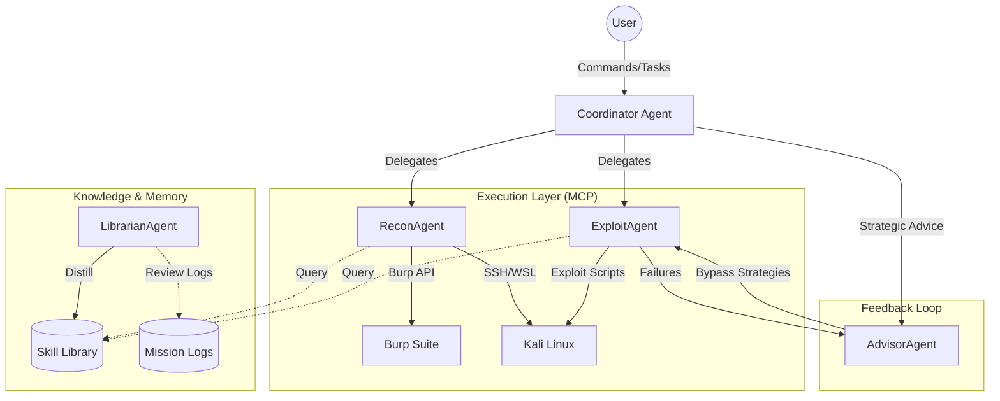

# 🏗️ 系统架构 (Architecture)

## 1. 整体架构图 (System Architecture)

## 2. 核心组件说明
- **Orchestration Core**: 基于 Python 的调度引擎，管理任务状态与 Agent 通讯。
- **Skill Library**: 195+ 结构化安全技能，支持 RAG 语义搜索。
- **MCP Connectors**: 标准化接口，用于控制外部安全工具（BurpSuite REST API, Kali SSH）。
- **Learning Engine**: 自动提取实战经验并沉淀为技能的闭环系统。
