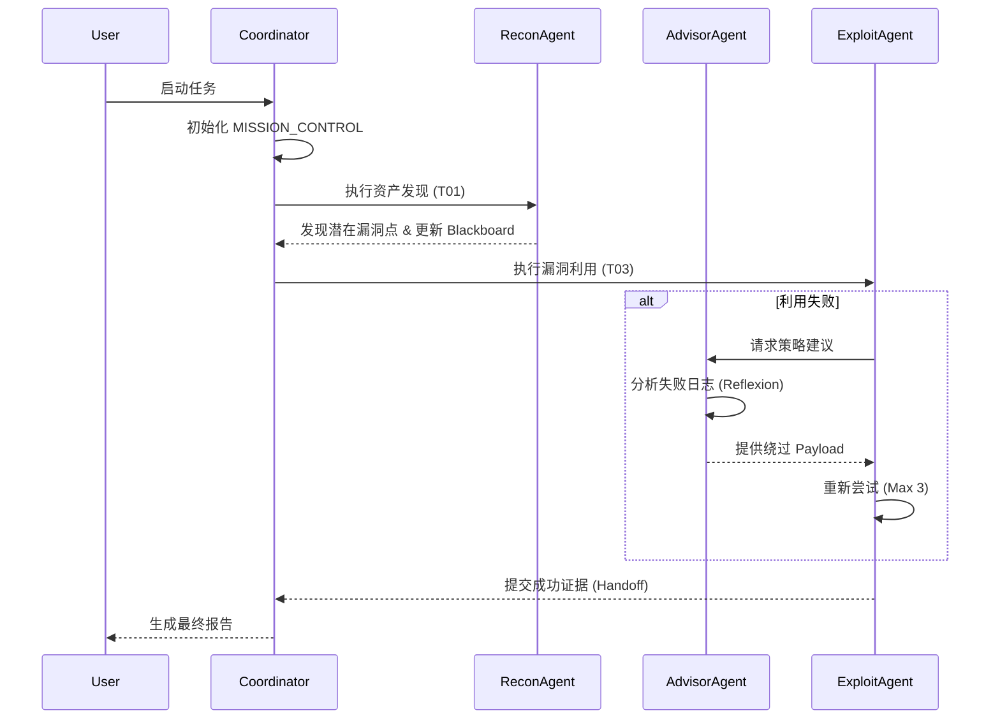

# 🔄 协作逻辑 (Workflow Logic)

## 1. 渗透测试任务流 (Main Flow)

## 2. 交接协议 (Handoff Protocol)
所有的 Agent 间转交必须使用 `framework/templates/HANDOFF_TEMPLATE.md`。这确保了：
1. **证据不丢失**：必须附带产出文件路径。
2. **上下文对齐**：必须包含已执行的操作与下一步建议。
